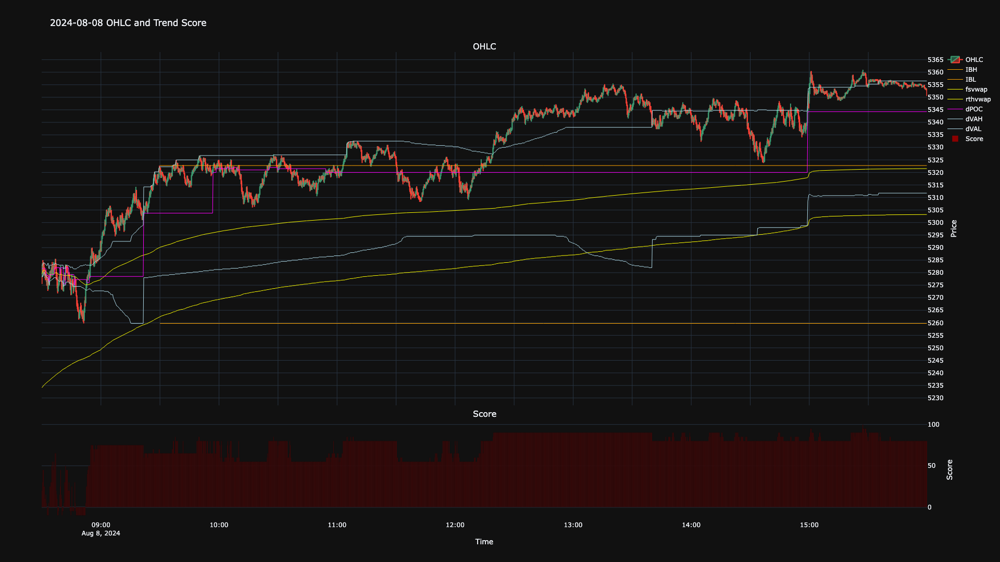
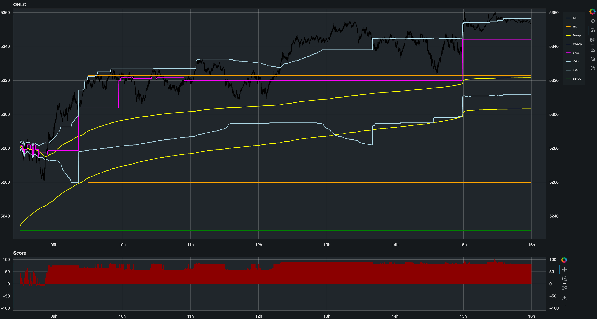
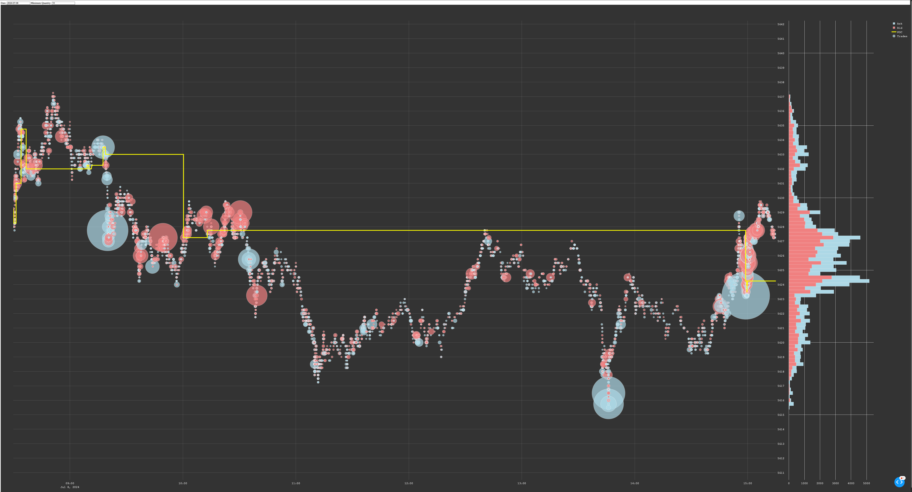

# DataViz

This directory contains three examples of data visualization based on the prepared Sierra Chart data.

Data was prepared using prior steps.
Visualizations focus on key trading metrics.
Examples include different types of plots for analysis.

Files included:
- `datavis.ipynb`: Jupyter notebook with the visualizations.
- `bokeh_plot.html`: bokeh output file.
- `newplot.png`: PNG file of plotly.
- `bokehoutput.png`: Bokeh output screenshot.
- `image.png`: PNG file of tick data.

## Screenshots

### Example 1

### Example 2

### Example 3

